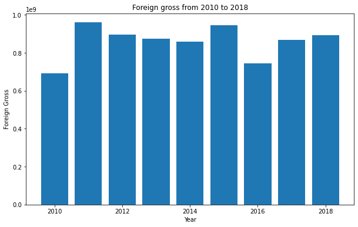

# Austin Animal Center Needs Analysis

**Author**: [Samuel Kabati](sam.kabati@student.moringaschool.com)

## Overview
This project analyzes film analytics in the box office. Exploratory analysis of the data shows the genres associated with an above average rating, as well as also investigating the relatonship between various variables in the dataset. Microsoft can use the analysis to understand what type of movies to start showing as well as the market they could target.

## Business Problem
To start the movie studio, relevant and accurate information on various titles is required. This will in the log run help save on start-up costs for the movie studio by doing what works and avoiding the hit or miss. This is crucial as it could determine whether the movie studio becomes popular and successful or whether it ends up failing. I explore the data to find genres that may be the best to start with and also investigate relationships that might have an impact on ratings.

## Data
The Data contains datasets obtained from:
-[Box Office Mojo](https://www.boxofficemojo.com/)
-[IMDB](https://www.imdb.com/)
-[TheMovieDB](https://www.rottentomatoes.com/)
-[The Numbers](https://www.the-numbers.com/)

## Methods

This project uses exploratory analysis, to analyze the datasets so as to summarize their main characteristics using statistical methods and visualisations.

## Results
 -Action is found in most titles with an above average rating. It would therefore be smart to include some sort of action in a movie as it the most popular genre.

 -Domestic gross appears to be inconsistent from 2010-2018. Foreign gross however, seems to be more consistent 
and higher as compared to Domestic gross.





## Conclusions


This analysis leads to three recommendations for the Microsoft Movie Studio Startup:

- **Action should be included in most movie titles.** Most movies with an above average rating of six have Action included in their genre list.This shows that Action is popular amongst most movie audiences
- **Focus on the foreign markets as well.** The foreign market is good for the business as the foreign gross is more consistent and higher as compared to the domestic gross.
- **Movie runtime could be fairly long or take an average runtime.** Runtime does not seem to have much of an impact on the rating.Therefore, runtime could be fairly long or average. The content delivered is what would matter the most.

### Next Steps

Further analyses could yield additional insights to:

- **Predicting the best list of genres to include in a movie for each market.** Being able to predict this would enable the movie studio to make titles specifically tailored for either foreign or domestic markets

## For More Information

See the full analysis in the [Jupyter Notebook](./animal-shelter-needs-analysis.ipynb) or review this [presentation](./Animal_Shelter_Needs_Presentation.pdf).

For additional info, contact Samuel Kabati at [samuel.kabati@student.moringaschool.com](https://gmail.com/)


## Repository Structure

```
├── images                
├── zippedData                  
├── cleaned_movie_gross.csv                    
├── cleaned_titles_and_ratings.csv                  
├── index.ipynb                
├── LICENSE
└── README.md
```
